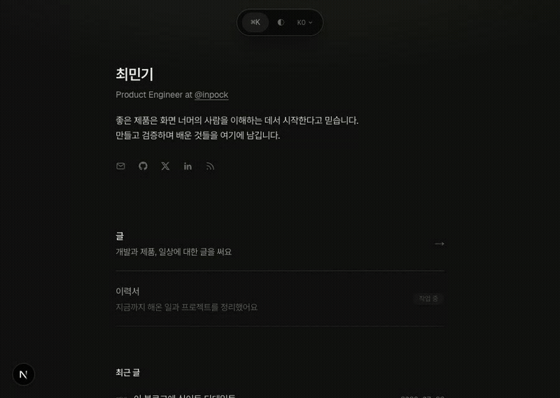

# chlalsrl.com

[English](./README.md) | [한국어](./README.ko.md) | **日本語**

個人ブログ。[chlalsrl.com](https://www.chlalsrl.com)



## 機能

- 全ページ静的生成、韓国語 / 英語 / 日本語の MDX コンテンツ
- View Transitions ベースのナビゲーション (タイトルモーフィング、エッジプレビュー付きスワイプ)
- Supabase のコメント・いいね、ログイン不要
- 全文検索コマンドメニュー (⌘K)
- コードで生成する OG 画像
- RSS、サイトマップ、JSON-LD、hreflang

## スタック

Next.js 16 · React 19.2 · TypeScript · Tailwind CSS v4 · Supabase · Bun · Biome

## 開発

```sh
bun install
bun run dev
```

## 自分のブログとして使う

MIT ライセンスです。ただし `src/contents` の記事は除きます。

1. `src/contents/{category}/{slug}/{locale}.md` の記事を差し替え
2. `src/app/[locale]/layout.tsx` と `src/app/[locale]/page.tsx` の名前・リンク・ドメインを修正
3. `next.config.ts` に自分の Supabase プロジェクトを設定 (またはコメント・いいねを削除)
4. `src/app/[locale]/layout.tsx` の GA id を差し替え
